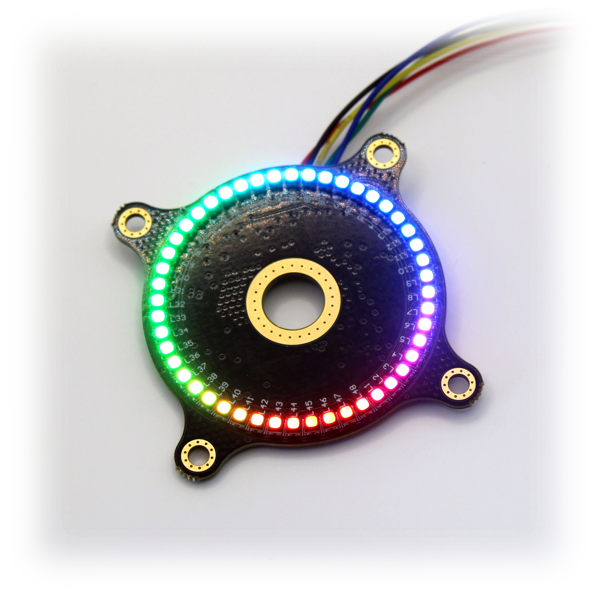

# RGB LED Ring
### This is the official repository of the RGB LED Ring!
### Available on my [DuPPa Store!](https://www.duppa.net/shop/rgb-led-ring/) or [Tindie](https://www.tindie.com/products/saimon/rgb-led-ring-v11/)!

The RGB LED Ring is an accessory of the rotary encoder.
The shaft  of the encoder can be insert in the center hole of the board. It support both the normal rotary encoder and the RGB encoder.

There are 48 RGB LED disposed in a circle with a 40mm diameter. In total there are 144 LEDs.
Each single LED can be controller with 256 step, then each RGB LED are encoded with the 888 format.
The controller is the [ IS31FL3745](https://www.lumissil.com/assets/pdf/core/IS31FL3745_DS.pdf)

In this repository you can find:
- [Schematic](EncoderRingV1.1.PDF)
- [Gerbers](/Hardware/Gerber%20Files/)
- [BOM](/Hardware/BOM/)
- [Pick & Place](/Hardware/Pick%20Place/)
- [3D File](/Hardware/STEP/)

[Here you can find the Arduino library](https://github.com/Fattoresaimon/ArduinoDuPPaLib)

